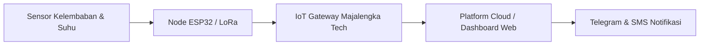

# AgriTech & Smart Farming IoT

## Latar Belakang & Potensi Lokal
Majalengka dikaruniai tanah yang sangat subur di kaki Gunung Ciremai—mulai dari sentra sayuran terasering Panyaweuyan di Argapura, perkebunan kopi Lemahsugih, hingga persawahan tadah hujan di dataran rendah.

Proyek open-source ini berfokus pada penyediaan perangkat telemetri ramah kantong dan tahan cuaca ekstrim:

## Spesifikasi Perangkat
- **Microcontroller**: ESP32 / RP2040 dengan modul LoRa SX1276 untuk jangkauan sinyal hingga 5-10 km di medan pegunungan.
- **Sensor**: Capacitive Soil Moisture Sensor (tahan korosi), DS18B20 (suhu tanah), dan DHT22/SHT31 (kelembaban udara).
- **Catu Daya**: Panel surya 5W + baterai LiFePO4 18650 untuk operasional otonom sepanjang tahun.
- **Otomasi Katup**: Relai penggerak solenoid valve 12V untuk menyiram bedengan sayur secara terukur.
