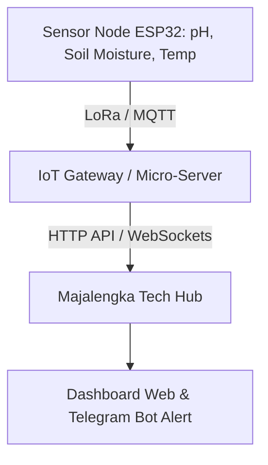

# AgriTech & Smart Farming IoT

## Latar Belakang
Majalengka memiliki lahan pertanian subur (padi dataran rendah, hortikultura sayuran di Argapura/Panyaweuyan, dan perkebunan kopi di lereng Ciremai). Inisiatif ini mengembangkan modul firmware dan dashboard telemetri terbuka berbasis microcontroller hemat daya (ESP32/RP2040) dengan transmisi LoRa / Wi-Fi.

## Arsitektur Solusi

## Fitur Utama
1. **Telemetry Real-Time**: Monitoring kelembaban tanah dan suhu udara di lahan terasering.
2. **Early Warning Frost/Hama**: Peringatan dini perubahan suhu drastis atau anomali cuaca.
3. **Automated Solenoid Valve**: Pengendalian kran air irigasi berdasarkan ambang batas kelembaban tanah.
4. **Open Source Firmware**: Repositori kode C++/MicroPython yang siap di-flash oleh petani muda dan SMK/kampus.
